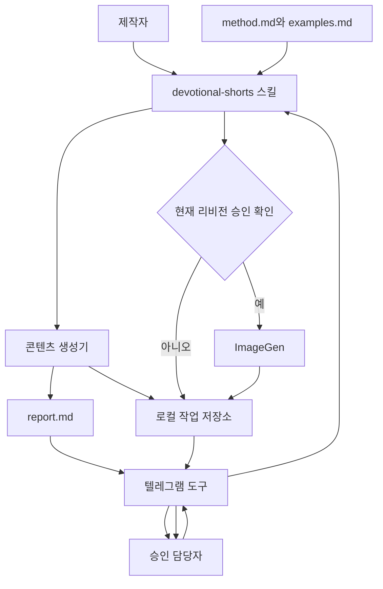

# 시스템 아키텍처

## 목적

`devotional-shorts-prep` 플러그인을 콘텐츠 생성, 승인, 이미지 생성, 전달이 서로 분리된 구성으로 설계한다. 각 구성요소의 책임과 파일 경계를 정해 구현 중 기능이 중복되거나 승인 게이트가 우회되지 않게 한다.

## 선행 조건

- [제품 요구사항](01-product-requirements.md)의 v1 범위가 확정되어 있다.
- [콘텐츠 제작 방법론](02-content-methodology.md)이 생성 품질의 기준이다.
- 실행 환경에 Codex 플러그인·스킬과 ImageGen이 제공된다.
- 사용자는 로컬 환경변수로 Telegram Bot API 접근 정보를 제공한다.

## 확정 요구사항

### 논리 구성

| 구성요소 | 책임 | 하지 않는 일 |
| --- | --- | --- |
| `devotional-shorts` 스킬 | 입력 해석, 방법론 로드, 생성 흐름 조정, 응답 분류, 승인 게이트 관리 | 비밀정보 저장, 상시 폴링 |
| 방법론 참조 | 제작 규칙과 승인 예시 제공 | 작업 상태 저장 |
| 보고서 템플릿 | 사람과 도구가 읽을 일관된 결과 구조 제공 | 콘텐츠 결정 |
| 작업 저장소 | 작업·리비전·방법론 스냅샷·이미지 보존 | 중앙 데이터베이스 역할 |
| 텔레그램 도구 | 설정 검증, 보고 전송, 답장 조회, 이미지 전송 | 자연어 의미 판단, 이미지 생성 |
| ImageGen 연동 | 승인된 장면 프롬프트로 이미지 생성 | 승인 판단, 보고서 수정 |

### 목표 플러그인 구조

```text
devotional-shorts-prep/
├── .codex-plugin/
│   └── plugin.json
├── README.md
├── skills/
│   └── devotional-shorts/
│       ├── SKILL.md
│       ├── references/
│       │   ├── method.md
│       │   └── examples.md
│       └── templates/
│           └── report.md
├── scripts/
│   └── telegram_bot.py
└── .env.example
```

작업 결과는 플러그인 설치 폴더가 아니라 사용자의 프로젝트 아래 `jobs/`에 저장한다. 플러그인 업데이트가 작업 데이터를 삭제하거나 덮어쓰면 안 된다.

### 컴포넌트 흐름



### 데이터 흐름

1. 스킬이 입력을 정규화하고 새 작업 ID를 만든다.
2. 스킬이 `method.md`를 읽고 버전과 SHA-256 해시를 계산한다.
3. 콘텐츠 생성 결과와 방법론 스냅샷을 리비전 폴더에 저장한다.
4. 텔레그램 도구가 요약과 `report.md`를 전송하고 메시지 ID를 반환한다.
5. 스킬이 메시지 ID와 `SENT_FOR_APPROVAL` 상태를 `job.json`에 기록한다.
6. `승인 확인` 시 텔레그램 도구는 원시 답장과 메타데이터만 반환한다.
7. 스킬이 승인 담당자, 답장 대상 메시지, 리비전, 답장 의미를 검증한다.
8. 현재 리비전이 승인된 경우에만 스킬이 ImageGen을 호출한다.
9. 생성 파일을 로컬에 먼저 저장한 뒤 텔레그램 도구로 전달한다.

### 외부 의존성

- **Codex 스킬 런타임**: 사용자 명령과 전체 흐름을 조정한다.
- **ImageGen**: 승인된 장면을 9:16 이미지로 생성한다.
- **Telegram Bot API**: HTTPS 요청으로 보고·답장 조회·파일 전달을 수행한다.
- **Python 표준 라이브러리**: 텔레그램 도구 구현에 사용하며 v1에 별도 패키지를 추가하지 않는다.
- **로컬 파일시스템**: 작업 상태와 결과의 단일 저장소다.

### 개발 원본과 설치본

- 개발 원본은 프로젝트의 `plugins/devotional-shorts-prep/`에서 관리한다.
- 개인 설치본은 사용자의 Codex 플러그인 경로에 설치한다.
- 원본을 수정한 뒤 플러그인 검증과 재설치를 거쳐 설치본을 갱신한다.
- 작업 결과는 설치본과 분리되므로 재설치해도 보존된다.
- 배포물에는 플러그인 폴더만 포함하며 `jobs/`, `source-materials/`, 실제 환경설정은 제외한다.

### 비밀정보 경계

- 저장소에는 변수명과 설정 예시만 포함한다.
- `TELEGRAM_BOT_TOKEN`, `TELEGRAM_CHAT_ID`, `TELEGRAM_APPROVER_IDS`의 실제 값은 로컬 환경에만 둔다.
- 로그와 오류 메시지는 토큰을 마스킹한다.
- 보고서에는 승인 담당자의 표시 이름은 기록할 수 있지만 원시 허용 목록 전체는 출력하지 않는다.

### v1에서 서버를 두지 않는 이유

승인은 제작자가 명시적으로 `승인 확인`을 실행할 때만 조회한다. 따라서 웹훅을 받을 공개 URL, 상시 프로세스, 외부 데이터베이스가 필요 없다. 이 구조는 설치가 단순하고 개인·소규모 팀 운영에 적합하다.

제약은 다음과 같다.

- 승인 후 자동으로 즉시 이미지가 생성되지 않는다.
- 제작자가 승인 확인 명령을 실행해야 한다.
- 보고 후 24시간이 지난 작업은 재전송해야 한다.
- 여러 실행 장치에서 동일 작업 폴더를 동시에 수정하는 운영은 지원하지 않는다.

## 예외 처리

- ImageGen을 사용할 수 없으면 승인 상태를 유지하고 이미지 생성을 시작하지 않는다.
- 텔레그램 전송이 실패하면 로컬 결과를 보존하고 재전송 가능 상태로 남긴다.
- `job.json`과 리비전 파일이 불일치하면 자동 복구하지 않고 `NEEDS_REVIEW`로 표시한다.
- 플러그인 방법론이 바뀌어도 기존 리비전은 저장된 스냅샷으로 해석한다.

## 완료 기준

- 각 기능이 하나의 책임 있는 구성요소에 배정된다.
- 승인 게이트를 우회해 ImageGen으로 들어가는 데이터 경로가 없다.
- 플러그인, 작업 데이터, 비밀정보의 저장 위치가 분리된다.
- 다른 사용자가 배포물만 설치하고 자신의 설정으로 실행할 수 있다.
