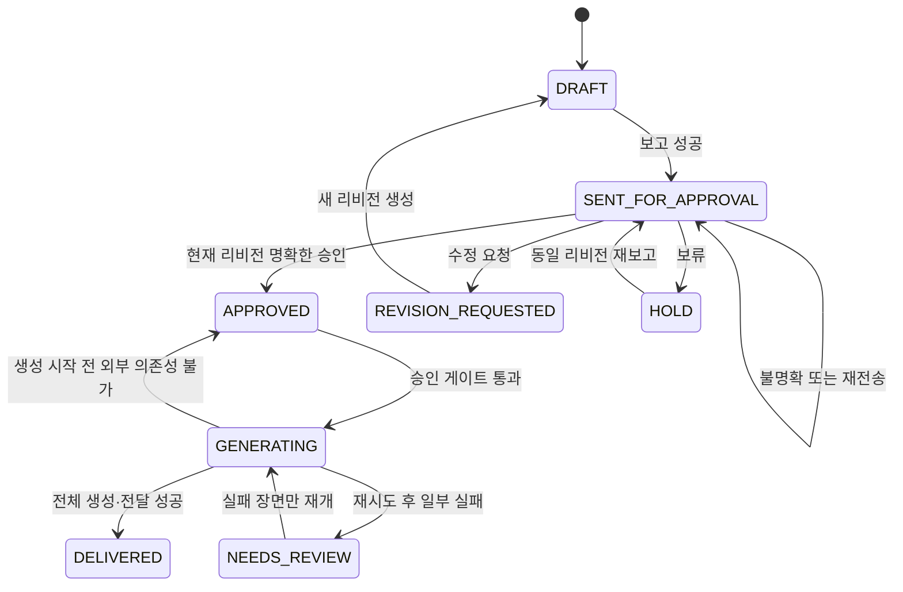

# 데이터 및 상태 설계

## 목적

작업 데이터, 리비전, 보고 메시지, 승인 상태, 이미지 결과를 파일 기반으로 안전하게 관리한다. 구현자가 필드 이름, 저장 위치, 상태 전이를 추가로 결정하지 않도록 표준을 고정한다.

## 선행 조건

- 하나의 프로젝트 폴더에서 한 번에 하나의 프로세스만 같은 작업을 수정한다.
- 콘텐츠 생성 결과는 [콘텐츠 제작 방법론](02-content-methodology.md)의 구조를 따른다.
- 텔레그램 보고와 이미지는 작업 ID와 리비전으로 연결된다.

## 확정 요구사항

### 작업 ID와 리비전

- 작업 ID 형식은 `ds-YYYYMMDD-HHmmss-xxxxxxxx`이다.
- 날짜와 시간은 실행 환경의 현지 시각을 사용하고 마지막 8자는 UUID의 소문자 16진수 앞 8자리다.
- 리비전은 1부터 시작하는 정수이며 파일 경로에서는 `r001`, `r002`처럼 세 자리로 표시한다.
- 콘텐츠가 수정되면 리비전을 하나 올리고 이전 리비전을 변경하지 않는다.
- 보고 재전송만으로는 리비전을 올리지 않는다. 새 보고 메시지 ID가 현재 리비전에 기록되고 이전 메시지는 승인 대상에서 제외된다.

### 작업 폴더 구조

```text
jobs/<job-id>/
├── job.json
└── revisions/
    ├── r001/
    │   ├── report.md
    │   ├── method-snapshot.md
    │   └── images/
    │       ├── scene-001.png
    │       └── scene-002.png
    └── r002/
        ├── report.md
        ├── method-snapshot.md
        └── images/
```

이미지 확장자는 실제 반환 형식에 따라 `.png`, `.jpg` 또는 `.webp`를 사용하되, 파일명 본체는 `scene-NNN`으로 고정한다.

### 입력 구조

| 필드 | 형식 | 필수 | 규칙 |
| --- | --- | --- | --- |
| `passage_text` | 문자열 | 예 | 공백만 있는 값은 거부 |
| `passage_reference` | 문자열 또는 null | 아니오 | 없으면 추측하지 않음 |
| `title` | 문자열 또는 null | 아니오 | 작업 표시용 |
| `date` | ISO 날짜 또는 null | 아니오 | 콘텐츠 게시일이 아니라 묵상 기준일 |
| `special_instructions` | 문자열 배열 | 아니오 | 현재 작업에만 적용 |
| `visual_overrides` | 객체 또는 null | 아니오 | 화풍·인물·특정 장면 지시 |

`visual_overrides`가 객체이면 `style`, `person`, `scene_instructions`만 사용한다. `style`과 `person`은 비어 있지 않은 문자열이며, `scene_instructions`는 장면 번호 문자열을 비어 있지 않은 지시 문자열에 연결한 객체다. 예: `{"style":"watercolor","person":"a Korean woman in her 40s","scene_instructions":{"3":"close-up framing"}}`. 존재하지 않는 장면 번호는 보고서 저장 전에 거부한다.

### 묵상 포인트 구조

| 필드 | 내용 |
| --- | --- |
| `background` | 본문 배경과 앞뒤 문맥 |
| `interpretation` | 복음주의적 핵심 해석 |
| `core_sentence` | 전체 작업을 관통하는 한 문장 |
| `application` | 현대 삶에 대한 적용 |
| `application_questions` | 1~2개 질문 배열 |

### 스크립트 구조

`script` 객체는 `core_sentence`, `thumbnail`, `opening`, `bridge`, `context`, `passage_summary`, `interpretation_application`, `conclusion`, `prayer`, `cta`, `full_text`, `estimated_seconds`, `duration_exception`, `duration_exception_reason`을 가진다. `context`는 불필요한 경우 빈 문자열이며 나머지 섹션은 필수다.

오프닝과 썸네일은 각각 `selected`, `alternatives`, `candidates`를 가진다. `candidates`는 후보 10개와 평가 점수를 저장하고, `alternatives`에는 선택안을 제외한 상위 3개를 저장한다.

### 이미지 장면 구조

| 필드 | 형식 | 설명 |
| --- | --- | --- |
| `scene_number` | 정수 | 1부터 연속 증가 |
| `source_text` | 문자열 | 장면이 담당하는 스크립트 문장 |
| `section` | 열거형 | `biblical`, `interpretation`, `modern_application`, `prayer`, `cta` |
| `setting` | 열거형 | `biblical_era` 또는 `modern` |
| `description_ko` | 문자열 | 한국어 시각 설명 |
| `prompt_en` | 문자열 | 영어 생성 프롬프트 |
| `prompt_hash` | SHA-256 | 프롬프트 변경 감지 |
| `status` | 열거형 | `PENDING`, `GENERATED`, `FAILED`, `DELIVERED` |
| `attempts` | 정수 | 최대 2회 |
| `local_path` | 문자열 또는 null | 프로젝트 기준 상대경로 |
| `image_hash` | SHA-256 또는 null | 저장된 이미지 파일 변경 감지 |
| `telegram_message_id` | 정수 또는 null | 전달 결과 |
| `error` | 문자열 또는 null | 토큰 등 비밀정보를 제외한 실패 원인 |

### `job.json` 필드 명세

```text
schema_version
job_id
created_at
updated_at
current_revision
status
input
method.version
method.sha256
revisions[].number
revisions[].created_at
revisions[].status
revisions[].report_path
revisions[].method_snapshot_path
revisions[].telegram.report_message_id
revisions[].telegram.report_sent_at
revisions[].telegram.last_update_id
revisions[].telegram.authorized_reply_ids
revisions[].approval.decision
revisions[].approval.decided_at
revisions[].approval.approver_ids
revisions[].approval.feedback
revisions[].devotional_points
revisions[].script
revisions[].quality_evaluation
revisions[].scenes
events[]
```

- `schema_version`은 데이터 형식 버전이며 최초 값은 `1`이다.
- `method.version`은 의미적 버전 형식을 사용한다.
- `method.sha256`은 정규화하지 않은 실제 `method.md` 바이트의 SHA-256이다.
- `quality_evaluation`은 의미 품질 다섯 축의 점수·평균·상세 근거·즉시 실패 목록을 보존한다. 이전 플러그인 버전에서 만든 리비전에는 이 필드가 없을 수 있으며 기존 승인 서명은 그대로 유효하다.
- 시간은 타임존이 포함된 ISO 8601 문자열로 저장한다.
- `events`는 상태 변경, 보고, 승인, 생성, 전달을 시간순으로 기록한다.
- 작업 데이터는 UTF-8 JSON이며 들여쓰기 2칸으로 저장한다.

### 상태 정의

| 상태 | 의미 |
| --- | --- |
| `DRAFT` | 현재 리비전 콘텐츠와 보고서가 로컬에 생성됨 |
| `SENT_FOR_APPROVAL` | 현재 리비전 보고서가 텔레그램에 전송됨 |
| `APPROVED` | 현재 보고 메시지에 대해 명확한 승인만 존재함 |
| `REVISION_REQUESTED` | 승인 담당자의 수정 요청이 존재함 |
| `HOLD` | 보류 응답이 있어 진행하지 않음 |
| `GENERATING` | 승인된 프롬프트로 이미지를 생성 또는 전달 중 |
| `DELIVERED` | 모든 장면 이미지가 로컬 저장되고 텔레그램으로 전달됨 |
| `NEEDS_REVIEW` | 데이터 불일치 또는 재시도 후 실패 장면이 존재함 |

불명확한 답장은 상태를 변경하지 않으며 `SENT_FOR_APPROVAL`을 유지하고 이벤트에 기록한다.

### 상태 전이



승인된 콘텐츠나 프롬프트를 변경하면 `APPROVED`를 유지하지 않고 새 리비전을 `DRAFT`로 만든다.

### 승인 결정 규칙

- 현재 `report_message_id`에 직접 답장한 메시지만 후보로 삼는다.
- `TELEGRAM_APPROVER_IDS`에 포함된 사용자 답장만 인정한다.
- 하나 이상의 수정 요청 또는 보류가 있으면 승인 답장이 함께 있어도 이미지를 생성하지 않는다.
- 승인 담당자의 명확한 승인만 있고 수정·보류가 없을 때 `APPROVED`가 된다.
- 여러 답장의 원문, 메시지 ID, 사용자 ID, 판정은 감사 이벤트로 기록한다.

### 멱등성

- 보고 전송 키는 `job_id:revision:report`다. 성공한 메시지 ID가 있으면 기본 실행에서 다시 보내지 않는다.
- 명시적 재전송은 새 메시지를 보내고 현재 `report_message_id`를 교체한다. 이전 메시지의 답장은 무효다.
- 승인 답장은 Telegram `update_id`로 중복 처리를 막는다.
- 이미지 생성 키는 `job_id:revision:scene_number:prompt_hash`다.
- 같은 키의 로컬 파일이 정상이고 해시가 일치하면 다시 생성하지 않는다.
- 텔레그램 전달 성공 메시지 ID가 있으면 같은 파일을 다시 보내지 않는다.

## 예외 처리

- `job.json` 쓰기는 임시 파일을 같은 디렉터리에 만든 뒤 원자적으로 교체한다.
- JSON 파싱 실패, 누락된 리비전 폴더, 해시 불일치는 `NEEDS_REVIEW`로 기록하고 진행을 중단한다.
- 장면 번호가 중복되거나 연속되지 않으면 이미지 생성을 거부한다.
- 현재 리비전과 승인 리비전이 다르면 승인을 무효로 처리한다.
- 성공 이미지가 존재하는 상태에서 일부 장면을 재시도할 때 정상 파일을 덮어쓰지 않는다.

## 완료 기준

- 모든 입력·출력·상태 필드가 고정되어 있다.
- 작업과 리비전의 보존 경계가 명확하다.
- 승인, 수정, 보류, 재전송, 이미지 실패의 상태 전이가 유일하게 결정된다.
- 같은 명령을 반복 실행해도 불필요한 보고·생성·전달이 발생하지 않는다.
