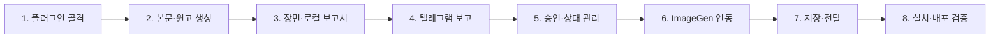

# 단계별 구현 로드맵

## 목적

전체 기능을 독립적으로 검증하고 커밋할 수 있는 여덟 단계로 나눈다. 각 단계는 선행 단계의 완료 기준을 통과한 뒤 시작하며, 다음 단계가 아직 없어도 현재 단계의 산출물을 확인할 수 있어야 한다.

## 선행 조건

- [제품 요구사항](01-product-requirements.md)부터 [이미지 생성 워크플로](07-image-generation-workflow.md)까지 검토되어 있다.
- 개발 원본은 프로젝트의 `plugins/devotional-shorts-prep/`에 만든다.
- 작업 결과는 프로젝트의 `jobs/`에 저장하고 플러그인 소스와 분리한다.
- 단계별 변경은 독립적으로 테스트한 뒤 커밋한다.

## 확정 요구사항

### 단계 의존 관계

## 1단계: 플러그인 골격과 기준 문서 구축

### 구현 목표

Codex가 설치·탐색할 수 있는 최소 플러그인과 `devotional-shorts` 스킬 골격을 만들고 제작 방법론을 런타임 기준 문서로 옮긴다.

### 선행 조건

- 본 기획 문서가 기준으로 승인되어 있다.
- 플러그인 이름은 `devotional-shorts-prep`, 스킬 이름은 `devotional-shorts`로 고정되어 있다.

### 생성·수정 구성요소

- 플러그인 매니페스트
- 스킬의 `SKILL.md`
- `references/method.md`, `references/examples.md`
- 보고서 템플릿
- `.env.example`과 플러그인 README

### 세부 작업

1. 유효한 개인 플러그인 기본 구조를 생성한다.
2. 스킬 설명에 본문 입력, 보고서 생성, 승인 확인 트리거를 명시한다.
3. 콘텐츠 방법론을 런타임에서 읽기 쉬운 규칙으로 정리한다.
4. 방법론 최초 버전을 `1.0.0`으로 선언한다.
5. 승인 예시 문서는 예시 형식만 정의하고 아직 제공되지 않은 원고를 만들어 넣지 않는다.
6. 보고서 템플릿에 필수 섹션을 고정한다.
7. 실제 비밀값 없이 환경변수 이름만 제공한다.

### 검증 방법

- 플러그인·스킬 검증 도구를 실행한다.
- 설치 전 상태에서도 참조 파일과 템플릿 상대경로가 유효한지 확인한다.
- 저장소 비밀정보 검색을 실행한다.

### 완료 조건

- Codex가 스킬 이름과 설명을 정상 인식한다.
- 방법론 버전과 필수 규칙을 읽을 수 있다.
- 코드 실행 없이도 보고서 템플릿 구조를 확인할 수 있다.

### 다음 단계 게이트

플러그인 및 스킬 검증이 모두 성공하고 방법론 규칙 누락이 없어야 2단계로 간다.

## 2단계: 본문 분석·묵상 포인트·스크립트 생성

### 구현 목표

본문 전문만으로 구조화된 묵상 포인트와 자체 검수를 통과한 낭독 스크립트를 만든다.

### 선행 조건

- 1단계 플러그인이 설치 가능한 상태다.
- `method.md`와 보고서 템플릿을 스킬에서 읽을 수 있다.

### 생성·수정 구성요소

- 스킬 입력 정규화 지침
- 본문 해설·후보 평가·스크립트 생성 지침
- 분량·문체·CTA 구조 검증기
- 작업 ID와 초기 `job.json` 생성 기능

### 세부 작업

1. 필수·선택 입력을 구분한다.
2. 방법론 버전과 해시를 기록한다.
3. 묵상 포인트 다섯 항목을 생성한다.
4. 오프닝·썸네일 후보를 각각 10개 생성하고 점수화한다.
5. 최종안과 대안 3개를 선택한다.
6. 고정 구조 스크립트를 생성한다.
7. 문체, CTA, 장절, 인용, 분량을 검증하고 한 번 자체 수정한다.
8. 결과를 `job.json`에 저장한다.

### 검증 방법

- 장절이 있는 본문과 없는 본문을 각각 실행한다.
- 짧은 본문과 문맥 설명이 필요한 긴 본문을 비교한다.
- 필수 섹션, 후보 수, CTA 완전 일치, 예상 시간을 자동 검사한다.
- 결과를 사람이 본문 충실도와 낭독 자연스러움 기준으로 검토한다.

### 완료 조건

- 본문 전문만으로 묵상 포인트와 스크립트가 생성된다.
- 기본 2분 또는 사유가 있는 최대 2분 30초 규칙을 지킨다.
- 외부 서비스 없이 로컬 결과를 확인할 수 있다.

### 다음 단계 게이트

기준 입력 전체에서 구조 검사가 통과하고 치명적인 본문 왜곡이 없어야 3단계로 간다.

## 3단계: 이미지 프롬프트 분할과 로컬 보고서

### 구현 목표

스크립트를 20자 누적 규칙으로 장면화하고, 담당자가 승인에 필요한 모든 내용을 담은 로컬 보고서를 만든다.

### 선행 조건

- 2단계 결과가 데이터 스키마와 자체 검수를 통과한다.

### 생성·수정 구성요소

- 문장 분리 및 20자 누적 로직
- 성경 시대·현대 장면 분류
- 한국어 설명·영어 프롬프트 생성 지침
- `report.md` 렌더링과 방법론 스냅샷 저장

### 세부 작업

1. 낭독문을 완결 문장으로 나눈다.
2. 20자 누적 장면 경계를 계산한다.
3. 장면 시대와 현대 인물 순서를 결정한다.
4. 장면별 한국어 설명과 영어 프롬프트를 만든다.
5. 프롬프트 해시와 `PENDING` 상태를 기록한다.
6. 보고서 템플릿으로 `report.md`를 만든다.
7. 방법론 스냅샷과 `job.json`을 원자적으로 저장한다.
8. 작업을 `DRAFT`로 확정한다.

### 검증 방법

- 19자, 20자, 21자 문장과 마지막 잔여 구간을 검사한다.
- 장면 원문을 이어 붙였을 때 낭독문 순서가 보존되는지 확인한다.
- 성경·현대 장면 스타일이 섞이지 않는지 확인한다.
- 이미지 파일이나 ImageGen 호출이 전혀 없는지 검사한다.

### 완료 조건

- 장면 번호가 1부터 연속이고 원고 누락이 없다.
- 보고서와 `job.json`의 장면 수·프롬프트가 일치한다.
- 로컬 보고서만으로 담당자가 승인 여부를 판단할 수 있다.

### 다음 단계 게이트

이미지 생성 없이 완전한 `DRAFT` 작업을 반복 생성할 수 있어야 4단계로 간다.

## 4단계: 텔레그램 설정 확인과 보고 전송

### 구현 목표

로컬 보고서를 전용 텔레그램 그룹에 안전하게 전송하고 현재 승인 기준 메시지를 저장한다.

### 선행 조건

- 3단계 `DRAFT` 작업이 존재한다.
- 테스트용 텔레그램 봇, 그룹, 담당자 ID가 로컬 환경에 설정되어 있다.

### 생성·수정 구성요소

- 표준 라이브러리 기반 `telegram_bot.py`
- `preflight`, `send-report` 하위 명령
- 토큰 마스킹과 API 오류 처리
- 보고 전송 상태 기록

### 세부 작업

1. 환경변수 파싱과 형식 검사를 구현한다.
2. 봇과 그룹 접근을 사전 점검한다.
3. 요약 메시지와 전체 보고서를 전송한다.
4. 요약 메시지 ID와 전송 시각을 저장한다.
5. 상태를 `SENT_FOR_APPROVAL`로 변경한다.
6. 명시적 보고 재전송과 이전 메시지 무효화를 구현한다.

### 검증 방법

- 모의 API로 정상·권한 없음·네트워크 오류를 검사한다.
- 테스트 그룹에서 요약과 보고서 순서를 확인한다.
- 보고 재전송 후 현재 메시지 ID가 하나만 유효한지 확인한다.
- 로그에 토큰이 노출되지 않는지 검색한다.

### 완료 조건

- 사전 점검 실패 시 메시지가 전송되지 않는다.
- 성공 시 상태와 메시지 ID가 정확히 저장된다.
- 같은 명령의 실수 반복으로 보고가 중복되지 않는다.

### 다음 단계 게이트

모의 테스트와 테스트 그룹 전송이 모두 성공해야 5단계로 간다.

## 5단계: 승인 답장 조회 및 상태 관리

### 구현 목표

현재 보고서에 대한 등록 담당자의 답장만 조회하고 승인·수정·보류·불명확으로 판정한다.

### 선행 조건

- 4단계 작업이 `SENT_FOR_APPROVAL` 상태다.
- 현재 `report_message_id`와 허용 담당자 목록이 존재한다.

### 생성·수정 구성요소

- `check-replies` 하위 명령
- 답장 유효성 검증과 자연어 분류 지침
- 상태 전이와 이벤트 기록
- 새 리비전 생성 및 보존 로직

### 세부 작업

1. 마지막 처리 지점 이후 업데이트를 가져온다.
2. 그룹, 답장 대상 메시지, 담당자 ID를 검증한다.
3. 유효 답장을 네 범주로 분류한다.
4. 수정·보류 우선 집계 규칙을 적용한다.
5. 승인 결과와 근거 메시지를 저장한다.
6. 수정 요청이면 변경 범위를 분석해 새 `DRAFT` 리비전을 만든다.
7. 중복 `update_id`, 이전 메시지, 이전 리비전 승인을 거부한다.

### 검증 방법

- 네 범주의 대표 문장과 조건부 승인 문장을 검사한다.
- 미등록 사용자와 이전 보고서 답장을 검사한다.
- 승인과 수정 요청이 함께 있을 때 수정이 우선하는지 확인한다.
- 같은 업데이트를 반복 조회해 상태가 중복 변경되지 않는지 확인한다.

### 완료 조건

- 승인 아닌 모든 경우에 이미지 생성 권한이 생기지 않는다.
- 현재 리비전의 명확한 승인만 `APPROVED`가 된다.
- 수정 요청은 이전 결과를 보존한 새 리비전을 만든다.

### 다음 단계 게이트

승인 게이트의 모든 부정 테스트가 통과해야 6단계로 간다.

## 6단계: 승인 후 ImageGen 연동

### 구현 목표

승인 게이트를 다시 검증하고 장면별 이미지를 순차 생성해 로컬에 저장한다.

### 선행 조건

- 5단계에서 현재 리비전이 `APPROVED`다.
- ImageGen이 사용 가능하다.

### 생성·수정 구성요소

- 승인 재검증 로직
- 장면별 ImageGen 호출 조정
- 이미지 형식·해시 확인과 저장
- 장면당 최대 두 번 시도 및 부분 실패 상태

### 세부 작업

1. 승인 정보와 현재 데이터 해시를 다시 비교한다.
2. 상태를 `GENERATING`으로 바꾼다.
3. 장면 번호 순서로 ImageGen을 호출한다.
4. 정상 이미지 형식을 확인하고 리비전 폴더에 저장한다.
5. 실패 장면을 같은 프롬프트로 한 번 재시도한다.
6. 계속 실패하면 `NEEDS_REVIEW`로 남긴다.
7. 성공 장면을 멱등성 키로 보호한다.

### 검증 방법

- 승인 전 호출 횟수가 0인지 자동 검사한다.
- 프롬프트 해시 변경 후 승인이 거부되는지 검사한다.
- 정상, 첫 실패 후 성공, 두 번 실패를 각각 검사한다.
- 성공 이미지가 재시도에서 덮어써지지 않는지 확인한다.

### 완료 조건

- 승인과 해시가 일치한 장면만 생성된다.
- 정상 파일이 번호순으로 로컬에 보존된다.
- 부분 실패에서 성공 결과가 손실되지 않는다.

### 다음 단계 게이트

승인 게이트, 재시도, 멱등성 테스트가 모두 성공해야 7단계로 간다.

## 7단계: 로컬 저장과 텔레그램 이미지 전달

### 구현 목표

로컬에 정상 저장된 이미지를 담당자에게 순서대로 전달하고 최종 상태를 확정한다.

### 선행 조건

- 6단계에서 하나 이상의 `GENERATED` 장면이 존재한다.

### 생성·수정 구성요소

- `send-images` 하위 명령
- 장면별 설명과 전달 결과 저장
- 실패 장면 재전송과 완료 요약

### 세부 작업

1. 파일 무결성과 장면 번호를 확인한다.
2. 전달되지 않은 성공 장면만 번호순으로 전송한다.
3. 메시지 ID를 장면 데이터에 저장한다.
4. 실패 전송은 생성과 분리해 재시도 가능하게 한다.
5. 전체 성공·실패 수를 요약 전송한다.
6. 전체 장면 전달 완료 시 `DELIVERED`로 변경한다.

### 검증 방법

- 모의 API에서 일부 전송 실패와 재개를 검사한다.
- 같은 명령 반복 시 중복 이미지가 전송되지 않는지 확인한다.
- 테스트 그룹에서 장면 번호와 보고서 순서가 일치하는지 확인한다.

### 완료 조건

- 정상 장면은 로컬과 텔레그램 양쪽에서 확인된다.
- 전체 전달 성공일 때만 `DELIVERED`다.
- 일부 실패는 `NEEDS_REVIEW`와 실패 목록으로 남는다.

### 다음 단계 게이트

로컬·텔레그램 결과와 상태가 일치해야 8단계로 간다.

## 8단계: 설치·배포·다른 사용자 검증

### 구현 목표

개발 환경 밖의 신규 사용자가 플러그인을 설치하고 자신의 설정으로 전체 흐름을 실행할 수 있게 한다.

### 선행 조건

- 1~7단계의 자동·종단간 테스트가 성공한다.
- 배포물에 비밀정보와 작업 결과가 없다.

### 생성·수정 구성요소

- 개인 마켓플레이스 항목과 설치 안내
- GitHub·압축 파일 배포 절차
- 신규 사용자 설정·진단 문서
- 버전 및 업데이트 정책

### 세부 작업

1. 플러그인 매니페스트와 배포 파일 목록을 검증한다.
2. 개인 설치본을 새로 설치해 캐시된 이전 버전의 영향을 제거한다.
3. 별도 테스트 사용자 설정으로 `preflight`를 실행한다.
4. 기준 본문으로 보고서 생성과 텔레그램 보고를 수행한다.
5. 승인 전 이미지가 생성되지 않는지 확인한다.
6. 승인 후 이미지 전달까지 수행한다.
7. 배포물에 `jobs/`, 토큰, 실제 ID, 원본 비공개 자료가 없는지 검사한다.

### 검증 방법

- 깨끗한 설치 경로에서 설치·업데이트·제거 후 재설치를 검사한다.
- GitHub 체크아웃본과 압축 해제본을 각각 검사한다.
- 신규 사용자가 README만으로 설정 가능한지 관찰한다.

### 완료 조건

- 신규 사용자가 자신의 텔레그램 설정만으로 전체 흐름을 완료한다.
- 개발자의 절대경로나 개인 설정에 의존하지 않는다.
- 배포물과 작업 데이터의 경계가 지켜진다.

### 다음 단계 게이트

이 단계의 완료 조건이 제품 v1 출시 게이트다.

## 예외 처리

- 앞 단계의 완료 조건이 실패하면 다음 단계 기능을 임시 우회 구현하지 않는다.
- 외부 API가 없어 검증할 수 없는 단계는 모의 테스트를 먼저 완료하고 실제 통합 테스트를 출시 게이트로 남긴다.
- 구현 중 새 제품 결정이 필요해지면 코드를 먼저 작성하지 않고 해당 기획 문서를 갱신한다.
- 단계 안의 기능이 커지면 같은 완료 조건을 공유하는 하위 커밋으로만 나누고 단계 순서는 바꾸지 않는다.

## 완료 기준

- 여덟 단계 각각에 목표, 선행 조건, 구성요소, 작업, 검증, 완료 조건, 게이트가 있다.
- 각 단계는 이전 단계만으로 시작할 수 있고 다음 단계 없이 검증 가능하다.
- 승인 게이트가 콘텐츠 생성과 이미지 생성 사이의 독립된 출시 게이트다.
- 8단계가 완료되면 [테스트 및 인수 계획](09-test-and-acceptance-plan.md)의 최종 체크리스트를 모두 수행할 수 있다.
