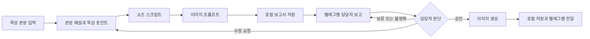

# 묵상 쇼츠 자동화 기획 문서

## 목적

이 문서 묶음은 묵상 본문 전문을 한 번 입력하면 묵상 포인트, 쇼츠 스크립트, 이미지 프롬프트를 만들고 담당자에게 보고한 뒤, 승인된 작업만 이미지로 생성·전달하는 `devotional-shorts-prep` 플러그인의 구현 기준이다.

이 `docs/` 폴더는 기획·구현 기준만 관리한다. 실행 코드는 `plugins/devotional-shorts-prep/`, 세션별 검증 증거는 `reports/`에 분리하며, 실제 비밀정보와 생성 이미지는 문서 폴더에 포함하지 않는다.

## 선행 조건

- 입력자는 묵상 본문 전문을 제공한다.
- 본문 위치, 제목, 날짜, 신학적 강조점, 화풍 지시는 선택 입력이다.
- 담당자는 전용 텔레그램 그룹에서 보고 메시지에 답장한다.
- 이미지는 현재 리비전에 대한 명확한 승인이 확인된 뒤에만 생성한다.

## 최종 자동화 흐름



## 확정 요구사항

| 항목 | 확정값 |
| --- | --- |
| 기본 영상 길이 | 2분 이내 |
| 예외 길이 | 문맥 설명이 반드시 필요한 경우 최대 2분 30초, 사유 보고 |
| 이미지 분할 | 완결된 문장을 누적하여 20자 이상일 때 장면 확정 |
| 외부 인용 | 출처를 검증할 수 있는 경우에만 사용 |
| 오프닝·썸네일 | 각 10개 후보 생성, 1개 자동 선택, 대안 3개 보고 |
| 보고 채널 | 전용 텔레그램 그룹 |
| 승인 확인 | 사용자가 Codex에서 `승인 확인 [작업 ID]` 실행 |
| 이미지 생성 게이트 | 현재 리비전의 명확한 승인 필수 |
| 기준 문체 | 한국어 낭독형 설교체, `다·나·까` 종결 |
| 이미지 비율 | 9:16 세로형 |

## 문서 열람 및 구현 순서

1. [제품 요구사항](01-product-requirements.md) — 사용자, 범위, 성공 기준을 이해한다.
2. [콘텐츠 제작 방법론](02-content-methodology.md) — 묵상 포인트와 원고 작성 규칙을 구현한다.
3. [시스템 아키텍처](03-system-architecture.md) — 플러그인 구성요소와 책임을 분리한다.
4. [데이터 및 상태 설계](04-data-and-state-design.md) — 작업 저장 형식과 승인 상태를 구현한다.
5. [콘텐츠 생성 워크플로](05-content-generation-workflow.md) — 본문에서 보고서까지 연결한다.
6. [텔레그램 승인 워크플로](06-telegram-approval-workflow.md) — 보고, 응답 조회, 승인 판정을 연결한다.
7. [이미지 생성 워크플로](07-image-generation-workflow.md) — 승인 이후 이미지 생성과 전달을 구현한다.
8. [단계별 구현 로드맵](08-implementation-roadmap.md) — 각 단계를 독립적으로 구현하고 검증한다.
9. [테스트 및 인수 계획](09-test-and-acceptance-plan.md) — 자동·수동 검증을 완료한다.
10. [운영 및 배포](10-operations-and-distribution.md) — 다른 사용자가 설치하고 운영할 수 있게 한다.

## 단계별 구현 체크리스트

- [x] 플러그인 골격과 제작 기준 문서 구축
- [x] 묵상 포인트와 스크립트 생성
- [x] 이미지 프롬프트와 로컬 보고서 생성
- [x] 텔레그램 설정 검증과 보고서 전송 구현·모의 검증
- [x] 담당자 응답 조회와 리비전별 상태 관리
- [x] 승인 게이트가 적용된 이미지 생성 계약 구현·모의 검증
- [x] 로컬 저장과 텔레그램 이미지 전달 구현·모의 검증
- [x] 68개 회귀·통합·모의 종단간 테스트
- [x] 격리된 신규 사용자 설치와 비밀정보 분리 검증
- [ ] 실제 테스트 그룹·Telegram 자격 증명·ImageGen을 사용한 외부 종단간 인수

## 제작 방식 자료 관리

[Claude 공유 대화](https://claude.ai/share/da7b79c1-b5de-4003-a238-78812225c8ba)는 초기 규칙을 추출한 출처다. 런타임에서 이 링크를 다시 읽지 않는다. 검토가 끝난 규칙은 플러그인의 `references/method.md`에 정규화하고, 승인된 원고는 `references/examples.md`에 추가한다.

이후 제공되는 원고나 작업 지침은 프로젝트의 `source-materials/`에 원본 그대로 보관할 수 있다. 원본 자료는 자동 실행 기준이 아니며, 사람이 검토해 `method.md` 또는 `examples.md`에 반영하고 방법론 버전을 올린 뒤에만 새 작업에 적용한다. 기존 작업은 당시 방법론 스냅샷을 계속 사용한다.

## 프로젝트 문서 검증

다음 명령은 11개 기획 문서, 필수 섹션, 상대경로 링크, 세션 01~09 보고서, 상태명, Telegram 명령, 확정값, 비밀정보 후보를 한 번에 검사한다.

```bash
python3 scripts/validate_project.py
```

## 예외 처리

- 본문 위치가 없으면 임의의 장절을 만들지 않고 `본문 위치 미확인`으로 보고한다.
- 승인 응답이 불명확하거나 수정·보류 의견과 함께 존재하면 이미지를 생성하지 않는다.
- 이미지 일부가 실패하면 성공 파일은 보존하고 실패 장면만 재시도한다.
- 새 방법론은 이미 완료되었거나 승인 대기 중인 리비전에 소급 적용하지 않는다.

## 완료 기준

- 이 문서에 연결된 10개 세부 문서가 모두 존재한다.
- 문서 간 용어, 상태명, 기본값과 승인 규칙이 일치한다.
- 구현자는 문서 순서대로 작업하면서 추가 제품 결정을 내릴 필요가 없다.
- 실제 비밀정보와 생성 이미지가 `docs/`에 포함되지 않고, 실행 코드는 플러그인 경계에 분리된다.
